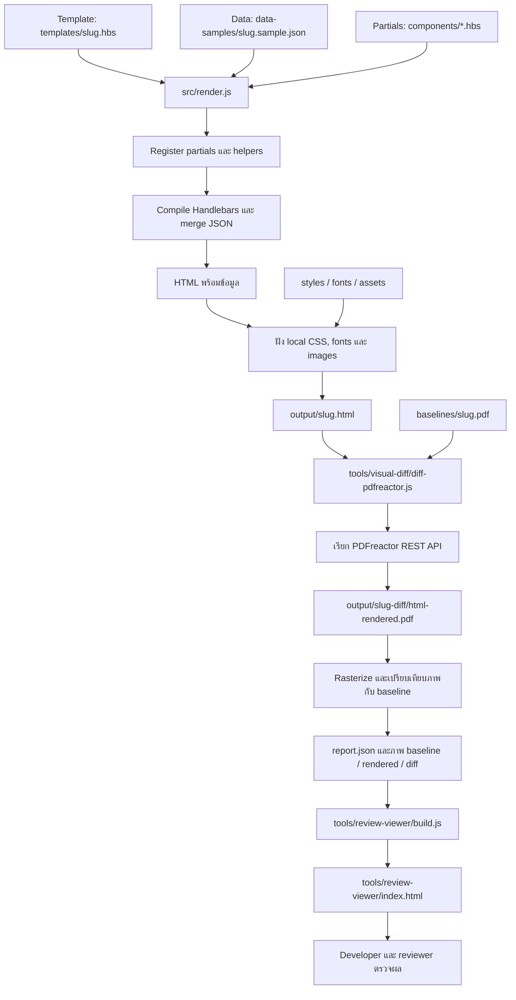

# Developer guide: Handlebars → PDF และการดูแล templates

คู่มือนี้อธิบาย workflow ที่มีอยู่จริงใน `poc-html-template` สำหรับ developer ที่สร้างหรือแก้เอกสาร อัปเดต 2026-10-02: เพิ่ม IPPLT rule/view-model example และ standalone PDF CLI

อัปเดต 2026-10-03: ผู้ใช้ยืนยัน scope รวมประมาณ800templates โดยเป็นLetterประมาณ300 และทีมเป็นdeveloperทั้งหมด. อ่าน [PLATFORM_BLUEPRINT.md](PLATFORM_BLUEPRINT.md) สำหรับ project structure/creation/release flow และ [platform/README.md](platform/README.md) สำหรับ CLI/configuration example ที่รันได้. เส้นทางใหม่ใช้ manifest และ versioned dependencies; คำสั่ง PoC เดิมด้านล่างยังใช้ได้

อ่าน [README.md](README.md) สำหรับภาพรวม และ [MIGRATION.md](MIGRATION.md) สำหรับการวิเคราะห์ DXF, extract assets และการวัด layout เทียบ Exstream

## 1. Flow การสร้าง PDF ปัจจุบัน



### แต่ละขั้นทำอะไร

1. `render.js` อ่าน arguments: template, JSON และ optional `--out` แล้วโหลด `.hbs` จาก `components/` เป็น partials
2. ลงทะเบียน helpers: `formatPercent`, `formatCurrency`, `eq` และ `barcode` โดย barcode เรียก `bwip-js` เพื่อสร้าง SVG จากข้อมูล
3. `Handlebars.compile(templateSource, { noEscape: false })` สร้างฟังก์ชัน render จากนั้น `template(data)` สร้าง HTML string; ขั้นนี้ยังไม่มี PDF และยังไม่ได้คำนวณการแบ่งหน้า
4. โค้ด resource inlining แทน local stylesheet links ด้วย `<style>` และแทน local CSS `url(...)`/image sources ที่รองรับด้วย data URIs เพื่อส่ง fonts/images เข้า Docker ได้ Remote URLs ไม่ถูกฝัง และ missing resources ยังเป็น warning จึงต้องตรวจ log
5. เขียน `output/<slug>.html` หรือตำแหน่งที่ระบุด้วย `--out`
6. `diff-pdfreactor.js` อ่าน HTML และ baseline แล้วส่ง HTML ผ่าน HTTP POST ไปยัง `http://localhost:9423/service/rest/convert.pdf` โดยปิด document JavaScript; เปลี่ยน service URL ได้ผ่าน `PDFREACTOR_URL`
7. PDFreactor จัด layout, fonts และ pagination แล้วส่ง PDF bytes กลับมา เครื่องมือบันทึกเป็น `output/<slug>-diff/html-rendered.pdf`
8. เครื่องมือใช้ Poppler แปลง PDF เป็น PNG ที่ 150 DPI ตรวจ evaluation pages และคำนวณ Page, Content และ Grid similarity; mask แถบ watermark บน/ล่างสำหรับการเปรียบเทียบ
9. Viewer builder อ่าน `output/*-diff/report.json` และสร้างหน้าดูภาพเทียบกัน ปุ่ม Pass/Fail เก็บใน browser localStorage เท่านั้น

**ขอบเขตปัจจุบัน:** `render.js` สร้างเฉพาะ HTML. ใช้ `node src/html-to-pdf.js <self-contained.html> <output.pdf>` หรือ `npm run pdf -- <self-contained.html> <output.pdf>` สร้าง PDF โดยไม่ใช้ baseline; ใช้ diff harness เดิมเมื่อมี matching baseline. ทั้งสองทางปิด document JavaScript. Evaluation pages ยังอยู่ใน PDF ที่บันทึก

ตัวอย่างแยก business rules จาก template อยู่ใน [IPPLT_EXAMPLE.md](IPPLT_EXAMPLE.md): `standard JSON v1 → contract validation → src/ipplt/view-model.js → prepared JSON → render.js → html-to-pdf.js`. Native input ไม่ใช้ชื่อตัวแปร Exstream; ข้อมูลเดิมต้องผ่าน `src/adapters/exstream-ipplt.js` อย่างชัดเจน. ดู naming/mapping ใน [IPPLT_DATA_CONTRACT.md](IPPLT_DATA_CONTRACT.md). รัน `npm run example:ipplt -- --pdf`; ยังเป็น synthetic PoC ไม่ใช่ upstream formula migration ที่สมบูรณ์

## 2. เตรียม environment และลองรันตัวอย่าง

รันคำสั่งจาก project root `poc-html-template/`:

```bash
npm install
node --version
command -v pdftoppm pdftotext
curl -sS --max-time 5 http://localhost:9423/service/rest/version
```

- ใช้ Node.js ที่ตรงกับ `package.json` (`>=16` เป็นขั้นต่ำที่ประกาศไว้; สำหรับ production ต้องเลือกเวอร์ชันที่ยังได้รับการสนับสนุน)
- `pdftoppm` และ `pdftotext` มาจาก Poppler; ต้องอยู่ใน PATH สำหรับ diff และการตรวจ evaluation page
- ต้องมี fonts/assets ที่ CSS และ JSON อ้างถึง
- หาก PDFreactor ยังไม่ทำงาน ดูส่วน A ของ [MIGRATION.md](MIGRATION.md) หรือเรียก `bash ../poc-translator/.pdfreactor/start.sh` จาก project root

รันตัวอย่างที่มีอยู่:

```bash
node src/render.js templates/pos-zlbnchg.hbs data-samples/pos-zlbnchg.sample.json
node tools/visual-diff/diff-pdfreactor.js output/pos-zlbnchg.html baselines/pos-zlbnchg.pdf output/pos-zlbnchg-diff
node tools/review-viewer/build.js
```

บน macOS เปิดผลได้ด้วย:

```bash
open output/pos-zlbnchg-diff/html-rendered.pdf
open tools/review-viewer/index.html
```

หรือใช้ `npm run viewer` เพื่อ build และเปิด viewer บน macOS

คำสั่งแต่ละขั้นต้องสำเร็จก่อนรันขั้นถัดไป Diff จะล้าง artifacts เดิมใน directory ปลายทางที่เครื่องมือดูแล จึงใช้ directory แยกเมื่อต้องการเก็บผลเปรียบเทียบหลายรอบ

## 3. Developer ควรแก้ไฟล์ไหน

| สิ่งที่เปลี่ยน | ตำแหน่งหลัก | ผลกระทบที่ต้องตรวจ |
|---|---|---|
| ข้อความเอกสาร, ลำดับ sections, data binding | `templates/<slug>.hbs` | เอกสารนั้นและทุก branch ที่แก้ |
| ตำแหน่ง, font size, spacing เฉพาะแบบ | `styles/<slug>.css` | ทุก sample ของ template นั้น |
| ข้อมูลตัวอย่าง | `data-samples/<slug>.sample.json` | ต้องรู้ว่าข้อมูลยังตรง baseline หรือไม่ |
| Header, footer, signature markup ที่ใช้ร่วมกัน | `components/*.hbs` | ทุก template ที่เรียก partial นั้น |
| Brand tokens, fonts, layout ร่วม | `styles/brand.css`, `typography.css`, `layout.css` | ทุก template ที่ใช้ stylesheet นั้น |
| Formatting helper หรือ render behavior | `src/render.js` | ทุก template ที่ได้รับผลกระทบ |
| รูปหรือ font file | `assets/`, `fonts/` | ผู้ใช้งาน asset/font ทุกจุด |

อย่าแก้ `output/*.html` หรือ generated viewer เพื่อเปลี่ยนเอกสาร เพราะรอบ render/build ถัดไปจะเขียนทับ ให้แก้ต้นฉบับแล้ว generate ใหม่

## 4. สร้าง template ใหม่


### ขั้นที่ 1 — กำหนด scope และ inputs

- ตั้งชื่อ slug เช่น `policy-notice` และระบุว่าเอกสารเกิดจากเหตุการณ์ใด มีเงื่อนไขหรือรายการซ้ำอะไรบ้าง
- เตรียม reference PDF พร้อมข้อมูลที่ใช้สร้าง reference นั้น เพื่อแยกปัญหาข้อมูลต่างจาก layout ต่าง
- ถ้า migrate จาก Exstream ให้ inspect DXF; ขั้นนี้ช่วยอ่านโครงสร้าง ไม่ได้สร้าง Handlebars ให้อัตโนมัติ

```bash
node src/dxf-inspect.js ../DXF/APP_YOUR_TEMPLATE.dxf
```

หากสร้างแบบใหม่โดยไม่มี Exstream ให้กำหนด approved design/reference และ acceptance criteria กับเจ้าของเอกสารก่อน การ render HTML ทำได้โดยไม่มี baseline แต่ diff command ปัจจุบันยังต้องการ baseline PDF

### ขั้นที่ 2 — เตรียมไฟล์และ data contract

ไฟล์ที่ควรมีสำหรับตัวอย่าง `policy-notice`:

```text
templates/policy-notice.hbs
styles/policy-notice.css
data-samples/policy-notice.sample.json
baselines/policy-notice.pdf
assets/policy-notice/                 # เมื่อมี assets เฉพาะเอกสาร
```

กำหนด field names ที่สื่อความหมาย เช่น `recipient.name`, `policy.number` และระบุ required/optional, รูปแบบวันที่, ความยาว และจำนวนรายการที่รองรับ ใช้ข้อมูลสังเคราะห์ในตัวอย่าง

ตัวอย่าง contract ขนาดเล็ก:

```json
{
  "subject": "แจ้งข้อมูลกรมธรรม์",
  "recipient": { "name": "ผู้รับตัวอย่าง" },
  "policy": { "number": "POL001" }
}
```

JSON ตัวอย่างนี้ใช้กับ scaffold ในขั้นถัดไปเท่านั้น หากเพิ่ม `page-header`, `signature-block` หรือ `page-footer` ต้องเพิ่มข้อมูลที่ partial นั้นต้องการด้วย ดูคำอธิบายด้านบนของไฟล์ partial

### ขั้นที่ 3 — เขียน template และ CSS

เริ่มจาก HTML ที่เรียบง่าย หรือ copy template ที่มีโครงสร้างใกล้เคียง ตัวอย่าง scaffold:

```handlebars
<!doctype html>
<html lang="th">
<head>
  <meta charset="utf-8">
  <title>{{subject}}</title>
  <link rel="stylesheet" href="../styles/brand.css">
  <link rel="stylesheet" href="../styles/typography.css">
  <link rel="stylesheet" href="../styles/layout.css">
  <link rel="stylesheet" href="../styles/policy-notice.css">
</head>
<body>
  <article class="page policy-notice">
    <h1>{{subject}}</h1>
    <p>เรียน {{recipient.name}}</p>
    <p>กรมธรรม์เลขที่ {{policy.number}}</p>
  </article>
</body>
</html>
```

สร้าง `styles/policy-notice.css` และ scope กฎเฉพาะแบบ เช่น `.policy-notice h1 { font-size: 12pt; }`

หลักการ authoring:

- `{{field}}` สำหรับข้อความ, `{{#each}}` สำหรับรายการ และ `{{#if}}` สำหรับเงื่อนไขการแสดงผล
- ใช้ `{{> partial-name}}` กับ markup ที่ใช้ร่วมกัน; ตรวจทั้ง data contract และ CSS ของ partial
- เก็บกฎธุรกิจซับซ้อนไว้ใน application/data preparation layer; PoC ยังไม่มี layer นี้แยกเป็น module
- Resource paths resolve จาก directory ของ template เช่น `../assets/...`; CSS `url(...)` resolve จาก directory ของ CSS
- จำกัด raw HTML เช่น `{{{...}}}` ให้เป็น output ที่ระบบควบคุม เช่น barcode SVG; `barcode` helper คืน `SafeString` อยู่แล้วจึงข้าม escaping ได้แม้ใช้ double braces
- POS มี fixed anchors และ CSS ของ shared signature markup อยู่ใน `pos-zlbnchg.css` อย่า copy แล้วถือว่ารองรับทุกชนิดเอกสารโดยไม่ทดสอบ
- POS, DIS และ IPPLT ใช้ `page-header` และ `address-with-barcode` ร่วมกัน พร้อม `letter-header.css` / `letter-address.css`. เรียก `{{> address-with-barcode}}` โดยไม่ส่งขนาดรายเอกสาร: profile กลางใช้ Code39, height20mm/scale2, fit="box" และกล่อง 62.2×25pt. `fit="box"` ให้ renderer ใส่ `preserveAspectRatio="none"` เฉพาะ barcode นี้. ดู [SHARED_STYLES.md](SHARED_STYLES.md) สำหรับรายละเอียดและ validation

### ขั้นที่ 4 — Render และแก้ warnings

```bash
node src/render.js templates/policy-notice.hbs data-samples/policy-notice.sample.json
```

ผลคือ `output/policy-notice.html` ตรวจ warnings ของ CSS/fonts/images/barcode และตรวจว่าข้อมูลสำคัญครบ Missing fields บางกรณีอาจแสดงว่างโดยไม่มี error เพราะยังไม่เปิด strict mode และไม่มี schema validator

### ขั้นที่ 5 — สร้าง PDF, diff และเปิด review

เมื่อวาง reference ไว้ที่ `baselines/policy-notice.pdf` แล้ว:

```bash
node tools/visual-diff/diff-pdfreactor.js output/policy-notice.html baselines/policy-notice.pdf output/policy-notice-diff
node tools/review-viewer/build.js
```

PDF อยู่ที่ `output/policy-notice-diff/html-rendered.pdf` Viewer จะพบ report ใหม่อัตโนมัติเมื่อ directory ลงท้ายด้วย `-diff`

ตรวจข้อความ, จำนวนหน้า, ลายเซ็น, barcode และ layout คู่กับ metrics หากต้องปรับ ให้แก้ HBS/CSS แล้วทำขั้น 4–5 ซ้ำ

### ขั้นที่ 6 — ทดสอบข้อมูลหลายกรณี

อย่างน้อยควรครอบคลุมข้อมูลปกติ, ชื่อ/ที่อยู่ยาว, optional fields ว่าง, รายการหลายรายการ และทุก branch ที่รองรับ

ใช้ output แยกสำหรับแต่ละ case เพื่อไม่ให้ทับกัน เช่น เมื่อเตรียม sample และ matching baseline สำหรับ long-name แล้ว:

```bash
node src/render.js templates/policy-notice.hbs data-samples/policy-notice.long-name.json --out output/policy-notice-long-name.html
node tools/visual-diff/diff-pdfreactor.js output/policy-notice-long-name.html baselines/policy-notice-long-name.pdf output/policy-notice-long-name-diff
```

ไฟล์ตัวอย่าง `policy-notice` ในคู่มือนี้เป็น naming examples ยังไม่ได้สร้างไว้ใน repository ห้ามนำ baseline ของข้อมูลคนละชุดมาอ้างว่าคะแนนต่างเกิดจาก CSS อย่างเดียว

### ขั้นที่ 7 — บันทึกและส่ง review

- บันทึกผลตรวจจริงใน `MIGRATION.md` พร้อมข้อจำกัด และเพิ่ม Change Log เมื่อ workflow/conventions/behavior เปลี่ยน
- ส่ง source template, CSS, assets, data contract/sample และผลตรวจให้ reviewer
- หากใช้ version control ให้เก็บการเปลี่ยนแปลงเป็นชุดเดียวกันและระบุเวอร์ชันที่ reviewer ตรวจ; workspace ที่ตรวจใน session นี้ยังไม่มี Git repository
- Pass ใน viewer เป็นสถานะ local ของ browser สำหรับ PoC ไม่ใช่ production approval record

## 5. แก้ template เดิม

1. **กำหนดสิ่งที่จะเปลี่ยน:** ข้อความ, ข้อมูล, layout หรือ shared component แล้วเลือกไฟล์ตามตารางในส่วน 3
2. **เก็บผลก่อนแก้:** เก็บ report/PDF เดิม หรือ render ลง directory แยก เช่น `output/pos-zlbnchg-before-diff` เพื่อเทียบกับหลังแก้
3. **แก้ source:** เปลี่ยนเฉพาะส่วนที่จำเป็น หากเปลี่ยน shared partial/CSS/helper ให้ค้นหาทุก template ที่ใช้งานก่อน
4. **Render → PDF → diff → review:** ใช้คำสั่งในส่วน 2 โดยใช้ sample และ baseline ชุดเดิมสำหรับตรวจ regression
5. **ตรวจกรณีที่เกี่ยวข้อง:** แก้ spacing ต้องตรวจข้อมูลยาว; แก้ conditional ต้องตรวจทุก branch; แก้ shared component ต้องตรวจทุก template ที่ได้รับผลกระทบ
6. **แยก intentional change:** หากข้อความหรือ design ใหม่ได้รับอนุมัติแล้ว baseline เก่าอาจไม่ตรง ต้อง review ความต่างและอนุมัติ baseline ใหม่อย่างชัดเจน ไม่แทน baseline ด้วย output ล่าสุดเพียงเพื่อให้คะแนนสูง
7. **บันทึกและส่ง review:** ระบุสิ่งที่เปลี่ยน เหตุผล ผลตรวจจริง และข้อจำกัดในเอกสารของโครงการ

ตัวอย่างค้นหาผู้ใช้ signature partial:

```bash
rg -n 'signature-block' templates components styles
```

## 6. เกณฑ์ตรวจผลและข้อจำกัดของเครื่องมือ

| การตรวจ | สิ่งที่ต้องยืนยัน |
|---|---|
| ข้อมูล | ชื่อ เลขกรมธรรม์ วันที่ และรายการตรงกับ input/expected result |
| เงื่อนไข | แสดง section ถูก branch และไม่เงียบหายเมื่อข้อมูลสำคัญขาด |
| Layout | ไม่มีข้อความซ้อน ถูกตัด หรือหลุดจากหน้าที่ตั้งใจ |
| จำนวนหน้า | ตรวจ PDF จริงและ log แยก evaluation page ออกจาก document pages |
| Barcode | ข้อมูลที่ encode ถูกต้อง; ภาพเหมือนไม่ได้พิสูจน์ว่าสแกนอ่านได้ |
| Visual metrics | ใช้ Grid/Content/Page ร่วมกับการตรวจภาพและข้อความ |
| Resources | ไม่มี missing font/image/CSS หรือ barcode warning |

ข้อควรรู้จาก implementation ปัจจุบัน:

- Diff ข้าม trailing rendered pages ที่เกิน baseline และค่าเฉลี่ยใช้เฉพาะหน้าที่ให้คะแนนได้ จึงห้ามใช้คะแนนสูงหรือ exit code 0 เป็นหลักฐานว่าจำนวนหน้าถูกต้อง
- Diff ยังไม่มี threshold gate ที่ทำให้ process fail เมื่อคะแนนต่ำ
- `pageNumber`/`pageTotal` ใน footer มาจาก JSON ไม่ได้คำนวณอัตโนมัติตามจำนวนหน้าของ PDF
- Viewer ใช้ local file URLs; ยังไม่ใช่หน้า static ที่ deploy ขึ้นเว็บแล้วทุกคนเปิดภาพได้ทันที
- ล่าสุดที่บันทึกสำหรับ POS: Grid 99.38%, Page 97.47%, Content 17.39% เป็นผลจากรอบปรับ layout ก่อนเขียนคู่มือนี้ ไม่ใช่การทดสอบใหม่ และไม่ใช่ threshold ที่ทุกเอกสารผ่านแล้ว

## 7. Flow ที่ควรเพิ่มสำหรับ production

ส่วนนี้เป็นข้อเสนอ ยังไม่ได้ implement ใน PoC:

```text
Request / batch job
  → เลือก template release ที่อนุมัติ
  → validate input schema และ business rules
  → เตรียมข้อมูลสำหรับแสดงผล
  → Handlebars render ด้วย templates/partials/helpers เวอร์ชันเดียวกัน
  → resolve เฉพาะ assets ที่อนุญาต
  → PDFreactor generate PDF
  → ตรวจผลและเก็บ PDF พร้อม job ID / template version
  → ส่งต่อระบบปลายทาง
```

Baseline diff ควรเป็นส่วนของ development/release regression pipeline; `html-to-pdf.js` แยก generation ที่ไม่ต้องใช้ baseline แล้ว แต่ยังต้องเพิ่ม production schema validation, fail-on-required-resource-error, job isolation, versioning และ durable review records. IPPLT มี validation เฉพาะ resolved-input contract ของตัวอย่าง ไม่ใช่ validation ครบทั้ง platform

## 8. Validation ของคู่มือนี้

ตัวอย่างที่ implement แล้ว: `dis-zlagchg` ใช้ PDF baseline ที่มีอยู่และไม่มี DXF; ดูคำสั่งและข้อจำกัดใน README/MIGRATION ส่วน fixture `dis-zlagchg.long-name.json` ใช้ตรวจ layout และ phone branch โดยไม่มี matching baseline

ตรวจคำสั่งและ output paths เทียบกับ `package.json`, `src/render.js`, `tools/visual-diff/diff-pdfreactor.js` และ `tools/review-viewer/build.js` แล้ว การเปลี่ยนครั้งนี้เป็น documentation-only ไม่ได้รัน PDF pipeline ใหม่ และไม่ได้สร้าง template ตัวอย่าง `policy-notice`
