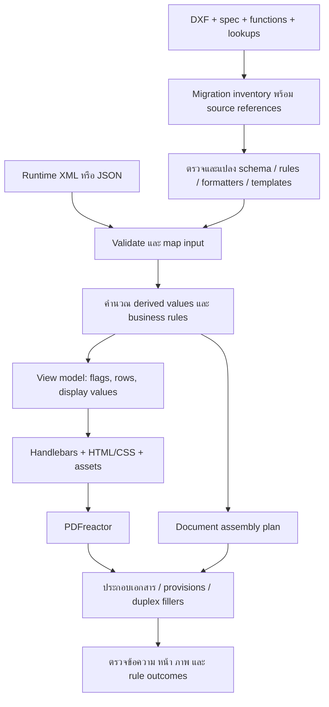

# DXF → rules → Handlebars → PDFreactor: ผลตรวจ 2026-10-02

## ข้อสรุป

ทำได้: DXF ชุดนี้มีตัวแปร, เงื่อนไขแสดงเนื้อหา, ตาราง/รายการซ้ำ, formatting และ layout ที่ใช้เป็นต้นทาง migration ได้ บางไฟล์มี variable formulas จริงด้วย แต่ **ไม่ใช่ทุก DXF จะมี business logic และ dependencies ครบ** จึงยังแปลงทั้งหมดเป็นระบบที่ทำงานเทียบเท่า Exstream โดยอัตโนมัติไม่ได้

แนะนำให้ platform มี data mapping + calculation/rule layer แล้วส่ง view model ให้ Handlebars สร้าง HTML/CSS และ PDFreactor จัดหน้า PDF. Handlebars ที่ใช้อยู่เหมาะกับงานนี้ ไม่จำเป็นต้องเปลี่ยน template engine เพียงเพื่อเพิ่มสูตร

นี่เป็นผลตรวจและแบบเสนอสำหรับ migration ไม่ใช่ implementation ของ platform ใหม่หรือการรับรอง template parity. รอบนี้ไม่ได้แก้ renderer/templates เดิมหรือรัน PDFreactor.

**Follow-up IPPLT:** ผู้ใช้เลือกตรวจ IPPLT ต่อแล้ว ดู [IPPLT_RULE_REVIEW.md](IPPLT_RULE_REVIEW.md). ยืนยัน 11 rules/12 use sites resolve ครบ แต่ไม่มี variable formulas และไม่พบนิยามองค์ประกอบร่วมบางส่วนที่เห็นใน PDF. ตรวจภาพครบ 4 cases แล้วพบรูปแบบคืนเงินรายการเดียวทั้งหมด จึงยังไม่ครอบคลุม multiple-payment branch. มีทางเลือก JSON evaluator, DMN, backend languages และ XSLT สำหรับผู้ใช้ที่ไม่ต้องการ JS

## 1. ขอบเขตและหลักฐาน

- ตรวจ `../DXF/*.dxf` ทั้ง 15 ไฟล์ รวม 1,147 variable declarations และ 116 variables ที่มี `formula` ไม่ว่าง (113 ใน Cube, 3 ใน ZLULMSTM). ตัวเลขเป็น declaration ต่อไฟล์ ไม่ใช่จำนวน business rules ที่ไม่ซ้ำหรือเปอร์เซ็นต์ความครบถ้วน
- ตรวจ PDF metadata ทั้ง 26 ตัวอย่างใน 12 กลุ่มใต้ `../PDF/Letter/`; extract ข้อความตัวอย่าง IPPLT, IEFNC และ ZLULMSTM กลุ่มละหนึ่งไฟล์เพิ่มเติม
- เก็บ counts, source SHA-256, XML errors, rule references, masks และ PDF metadata โดยไม่เก็บ display/sample values ใน [inventory.json](output/dxf-audit-2026-10-02/inventory.json)
- ใช้ Python standard-library XML parser แบบไม่โหลด external DTD; 13 ไฟล์ parse ได้ตรงต้นฉบับ อีก 2 ไฟล์อ่านเพื่อสำรวจโดยลบ U+0004 **เฉพาะใน memory** ต้นฉบับไม่เปลี่ยน
- ตรวจ definition และจุดอ้างอิงของ rules ตัวอย่าง ไม่ได้พิสูจน์ execution semantics ของ Exstream ทุกคำสั่ง

| DXF | Variables | มี formula | Usage rules ที่มี body / ทั้งหมด | ข้อสังเกต |
|---|---:|---:|---:|---|
| APP_LTPOSZLBNCHG001 | 27 | 0 | 6 / 6 | จดหมายเดิม มีเงื่อนไขที่อยู่ |
| APP_LTPOSZLCNCIDC001 | 17 | 0 | 4 / 4 | มี matching PDF หนึ่งหน้า |
| APP_IntegralLife_INTUC | 27 | 0 | 12 / 12 | มีเงื่อนไข/array และ matching PDF |
| APP_IntegralLife_IPPLT | 26 | 0 | 11 / 11 | 4 PDFs; single/multiple payment; custom amount mask |
| APP_NON_FN_IENFC | 45 | 0 | 26 / 27 | Request type/name/payor conditions; มี mixed AND/OR |
| APP_IEFNC_FinancialChange | 75 | 0 | 32 / 41 | จดหมาย + pass-through rider + receipt |
| APP_ZLFINCHG | 66 | 0 | 40 / 43 | Rider/reinstatement sections; provision dependency ยังขาด |
| APP_LTULFSU001 | 43 | 0 | 20 / 20 | PDF กลุ่ม ZLFSUR ตรง application; ZLFSURI ไม่ตรง |
| LA_ZLPSP | 24 | 0 | 5 / 5 | มี rule references เพิ่มอีก 4 IDs ที่ไม่มี declaration |
| APP_LA_ZLULMSTM | 45 | 3 | 15 / 15 | XML มี U+0004 หนึ่งจุด; PDF application ไม่ตรง |
| APP_IntegralLife_IPMRF | 28 | 0 | 13 / 15 | ไม่มี matching PDF ในโฟลเดอร์ Letter ที่ตรวจ |
| APP_Cube_AppForm | 572 | 113 | 9,604 / 9,635 | มีสูตรหลายบรรทัด/loops/custom function calls; ไม่ใช่ letter |
| APP_Ecommerce_AppForm | 36 | 0 | 126 / 126 | มี conditional content และ text rules |
| APP_Ecommerce_SalesProposal_IL_Group1 | 70 | 0 | 38 / 46 | XML มี U+0004 ห้าจุด |
| APP_Ecommerce_SalesProposal_IL_Group2 | 46 | 0 | 25 / 29 | มีเงื่อนไขภาษา/สินค้า |

Usage-rule counts นับเฉพาะ `dlg:usage-rule`; ยังมี `dlg:text-rule` อีกในบางไฟล์ (ดู inventory). Body ไม่ว่างอาจมี comments จึงไม่เท่ากับ executable rule ที่สมบูรณ์. Body ว่างต้องดู `default-include`, selection mode และ context ไม่ควรตีความว่า false หรือ missing เสมอไป

## 2. สิ่งที่เอาออกจาก DXF ได้

| สิ่งที่ต้องการ | หลักฐานใน DXF | ย้ายไปที่ใด / ข้อจำกัด |
|---|---|---|
| ชื่อ/ชนิดข้อมูล/array | `dlg:variable`, `data-type`, `multi-valued`, `array-*` | Input schema + mapping; ไม่ได้แปลว่ามี source XPath/JSON path ครบ |
| สูตรคำนวณ | `formula`, `var-calc-method`, `compute-time` | Calculation functions; ต้องตาม dependencies และลำดับ evaluation |
| เงื่อนไขแสดงข้อความ/แถว | `dlg:usage-rule/dlg:content` และ `usage-rule` references | Boolean rules → `{{#if}}`; ต้องรักษา default/parent conditions |
| ข้อความตามเงื่อนไข | `dlg:text-rule` | แยก inspect/translate เพิ่ม ไม่รวมใน usage-rule counts |
| ตารางซ้ำ | `fo:table-row`, `auto-row-*`, `SYS_TableRow`, `varuse-array-*` | Array of row objects → `{{#each}}`; ตรวจ index/filter/order/grouping |
| รูปแบบค่า | variable format attributes และ `dlg:variable-use` overrides | Named formatters; ตรวจ mask, decimal, zero/negative/date semantics |
| หน้าตา | FO blocks/tables, font, color, spacing, geometry | Semantic HTML/CSS; ต้องวัดเทียบ PDF ไม่ใช่ copy FO เป็น CSS ตรง ๆ |
| ประกอบเอกสาร | `dlg:document`, selection/queue rules, pass-through, duplex/filler | Document assembly plan ก่อน/หลัง render ตามชนิดส่วนประกอบ |

`display-string` เป็นข้อมูลสำหรับการแสดง/ออกแบบ ไม่ใช่หลักฐานของสูตรต้นทาง. แม้ export ระบุ `var-calc-method="constant"` ก็ไม่ควร hard-code ค่าตัวอย่างลงระบบจริง: เช่น IPPLT ส่งออกทั้งยอดเงินและจำนวน payment แบบนี้ แต่ไม่มีสูตรที่ได้ค่าดังกล่าวในไฟล์ ต้องหา mapping/ขั้นเตรียมข้อมูลจาก source เพิ่ม

Inspector เดิม `src/dxf-inspect.js` แสดงชื่อ/ชนิดตัวแปรและ element counts เป็นหลัก แม้ comment จะกล่าวถึง rules แต่ยังไม่ได้ print formula bodies, resolve rule references หรืออธิบาย format overrides. จึงไม่ควรใช้ output เดิมตัดสินว่า DXF ไม่มี logic

## 3. ตัวอย่างจดหมายที่ตรวจเจาะจง

### IPPLT — แปลงเงื่อนไขไป platform ได้ชัดเจน

ใน `APP_IntegralLife_IPPLT.dxf`:

- Rule 8359 (บรรทัด 249–257): include เมื่อ `U_Payment_Amount > 0 AND IL_DRV_Check_Multi_Payment = 1`
- Rule 8381 (บรรทัด 258–266): include เมื่อ `U_Payment_Amount > 0 AND IL_DRV_Check_Multi_Payment > 1`
- ทั้งคู่ `default-include="false"`; ผูกกับ `fo:block` ผ่าน `Rule|8359|` / `Rule|8381|` ที่บรรทัด 605, 615 และ 625
- Rule 9361: payment count = 1 และ method เป็น `1`, `B` หรือ `6`; rule 9362: count > 1 และ `U_Payment_Amount_Draft` ไม่ว่าง
- `U_Payment_Amount` มี per-use mask `###,###,###,##0.##` สองแห่ง; ไม่ควรแทนด้วย helper ที่บังคับ `.00` โดยยังไม่ตรวจ semantics/ตัวอย่างทศนิยม

ตัวอย่าง **เฉพาะสอง rule แรก** หลัง input mapping/validation ไม่ใช่ IPPLT ทั้งฉบับ:

```js
function deriveIppltVisibility(input) {
  const amount = input.U_Payment_Amount;
  const count = input.IL_DRV_Check_Multi_Payment;
  if (typeof amount !== 'number' || !Number.isFinite(amount) ||
      !Number.isInteger(count) || count < 0) {
    throw new TypeError('Expected finite amount and nonnegative integer payment count');
  }
  return {
    showSinglePayment: amount > 0 && count === 1, // source rule 8359
    showMultiplePayments: amount > 0 && count > 1 // source rule 8381
  };
}
```

Platform ส่ง flags เหล่านี้พร้อม display values และ rows ที่เตรียมแล้วให้ template:

```handlebars
{{#if flags.showSinglePayment}}
  {{> ipplt-single-payment}}
{{/if}}
{{#if flags.showMultiplePayments}}
  {{> ipplt-multiple-payments}}
{{/if}}
```

ชื่อ partials ในตัวอย่างเป็นแบบเสนอ ยังไม่ได้สร้างใน project. ไม่ควรใช้ `{{#if paymentAmount}}` แทน `> 0` เพราะค่าติดลบก็ truthy. ไม่ควรสมมติว่า count เท่ากับความยาว array จนกว่าจะยืนยัน mapping เดิม

### IEFNC — เห็นกฎระดับเอกสาร ไม่ใช่แค่ paragraph

`APP_IEFNC_FinancialChange.dxf` มี 3 documents:

1. `DOC_IEFNC_New` — normal letter
2. `DOC_IEFNC_RiderProvision` — pass-through รับ `F_IPACK_Placeholder_RiderProvision`; rule 10558 บรรทัด 759 เป็นต้นไปตรวจ queue ที่กำหนด และ `U_IEFNC_Show_AddRider = "Y"`
3. `DOC_IEFNC_Receipt` — normal document; rule 10480 บรรทัด 770 เป็นต้นไปตรวจ queue และ `U_IEFNC_Show_DeductAndLoan`; เงื่อนไข transaction เก่าใน comment ไม่ใช่ active logic

จึงย้าย document selection ไป assembly rules ได้ แต่ต้องหา logic ที่สร้าง flags และเลือก provision resources เพิ่ม เพราะ variable formula fields ของไฟล์นี้ว่างทั้งหมด. PDF ตัวอย่างสองหน้าเป็นหนึ่ง case ไม่ครอบคลุมทุก branch

### ZLULMSTM — มีสูตรจริง แต่มี dependencies ภายนอก

`APP_LA_ZLULMSTM.dxf` มี:

- `U_Report_From_Date` / `U_Report_To_Date`: `value=GetFullThaiDate(...)` (declaration แถวบรรทัด 72 และถัดไป)
- `U_Current_Bill_FrequencyDesc` (formula บรรทัด 126): ถ้า plan = `ULX1` ให้ “รายปี”; มิฉะนั้นเรียก `GET_THAI_MAPPING_SP("PAYMENT_FREQUENCY", ...)`; **หลังจากนั้น** ถ้า frequency = `00` ให้ override เป็น “ครั้งเดียว”

นี่พิสูจน์ว่าย้าย decision order ได้ แต่ยังไม่มี function implementation หรือ lookup data ของสองฟังก์ชันนี้ในชุด DXF ที่ตรวจ. ต้องตรวจภาษา/พ.ศ./invalid dates ของ date formatter และค่า mapping จากต้นทาง ไม่เดาจากชื่อ function. Logging calls ในสูตรต้องพิจารณาแยกจากผลลัพธ์ค่า

PDF กลุ่ม ZLULMSTM มี Title `APP_STULKAP001MO_New` แต่ DXF มี application `APP_LA_ZLULMSTM`; จึงใช้ PDF นี้ยืนยัน formula/layout parity โดยตรงไม่ได้จนกว่าจะยืนยันความสัมพันธ์/version

### ZLFINCHG — ไฟล์เพิ่มยังไม่ปิดช่องว่างเดิม

ยังพบ reinstatement/add/lapse rider rules และ pass-through `F_Placeholder_MainPlanRiderProvisionNewDuplex` (บรรทัด 2180) แต่ไม่มี variable formulas และ rule 85754 body ว่าง. ค้นทั้ง 15 DXFs แล้วไม่พบ `SET_RIDER_PROVISSION_LA`.

หลักฐานจาก XLSX ที่เคยอ่านยังอยู่ใน [INPUT_REVIEW.md](INPUT_REVIEW.md): ต้องได้ function body และ mapping/provision sources เพื่อสร้าง attachment plan ได้ครบ ไม่ควรนำ rule ที่แสดงตาราง rider มาใช้เป็นกฎเลือกไฟล์แนบแทน

## 4. ข้อจำกัดใหม่ที่ต้องจัดการ

- **LA_ZLPSP:** references `Rule|5163|`, `5164`, `5165`, `5166` ที่บรรทัด 331/336/341/350 ไม่มี usage-rule declarations ของ IDs เหล่านี้ในไฟล์; อยู่ใน address blocks. ห้ามนำ rule ID จาก application อื่นมาเติมโดยอัตโนมัติ
- **XML controls:** Group1 sales proposal parse ล้มที่บรรทัด 5936 คอลัมน์ 239; ZLULMSTM ที่ 1288 คอลัมน์ 236. การลบ control ใน memory ใช้เพื่อสำรวจเท่านั้น ต้องมี re-export หรือ sanitation policy ที่บันทึกการเปลี่ยนแปลงก่อนใช้ production
- **IENFC mixed AND/OR:** rule 9974 และบาง rules ไม่มี parentheses กำหนดกลุ่มครบ. ต้องตรวจ precedence ของ source language และทดสอบ combinations ก่อนแปลง ห้ามจัดกลุ่มตามความหมายที่คาดเอง
- **Format enums:** ตัวเลขอย่าง `format="12"` ไม่ได้อธิบายความหมายในตัว ต้องใช้ vendor specification/ผลจากต้นทางประกอบ; per-use override อาจต่างจาก variable default
- **Function bodies:** Cube มีตัวอย่าง `value = F_GetData_Agent()` ที่บรรทัด 1681 แต่ไม่พบ function-definition elements ใน DXF ทั้งชุด. สูตรที่มีชื่อเรียกไม่เท่ากับได้ implementation ครบ
- **Matching inputs:** ZLFSUR ใหม่มี PDF Title `APP_LTULFSU001` ตรง DXF ที่มี; ส่วน ZLFSURI ยังเป็น `APP_LTZLFSURI001` และยังไม่มี matching DXF. DIS_ZLAGCHG ก็ยังไม่มี matching DXF

## 5. รูปแบบ platform ที่เสนอ



แต่ละ layer รับผิดชอบ:

- **Mapping/schema:** source field → typed value, required/optional, defaults และ validation; ส่งค่าจำนวนเงินให้ arithmetic layer ที่มี rounding/precision ชัดเจน
- **Rules/calculations:** ใช้ JS/TS functions ที่มี tests สำหรับ PoC; เก็บ source file + application + object ID + version. หากผู้ใช้ธุรกิจต้องแก้ rules ผ่าน UI ภายหลัง จึงเพิ่ม decision tables หรือ typed expression AST ที่รองรับ operators/functions แบบกำหนดรายการ ไม่รัน raw DXF code ด้วย `eval`
- **Formatting:** shared helpers หรือเตรียม display values ก่อน render; เก็บ format mask/override เป็น metadata พร้อม expected output cases. อย่าบังคับทุก amount/date ให้มี format เดียว
- **Handlebars:** ข้อความ, `#if`, `#each`, partials และ safe output escaping; ไม่ทำ database lookups หรือแก้ state ทางธุรกิจระหว่าง render
- **Assembly:** แยก document inclusion, order, attachment lookup และ duplex policy. PDFreactor รองรับ merge/arrange PDFs แต่ยังต้องเขียน business selection/ordering เอง; PoC ปัจจุบันยังไม่มี assembly layer นี้
- **Validation/versioning:** fixtures ต่อ branch, expected values, text/page/visual checks และบันทึก version ของ rules/templates/assets ที่ใช้สร้างแต่ละ output

DXF เป็น migration input ไม่จำเป็นต้อง parse ทุกครั้งที่ generate เอกสาร. เก็บ original source ไว้ trace กลับได้ และตรวจ unresolved dependencies ก่อน publish template version

เอกสารทางการที่ตรวจประกอบ: [Handlebars helpers](https://handlebarsjs.com/guide/builtin-helpers.html), [PDFreactor REST API](https://www.pdfreactor.com/product/webservice/doc/swagger/rest/), [PDFreactor manual](https://www.pdfreactor.com/product/doc_html/manual-lib.html). ความสามารถของเครื่องมือรองรับ flow นี้ แต่ไม่รับรองการแปล Exstream semantics โดยอัตโนมัติ

## 6. ขอบเขตตัวอย่างที่ควรพัฒนาต่อ

เริ่ม IPPLT: มี matching DXF + PDFs 4 cases, rule bodies ครบทั้ง 11 ตัว, มีทั้ง single/multiple payment และ format override. ต้องขอ/ค้น runtime input mapping และข้อมูลต้นทางของทั้ง 4 outputs แล้วสร้าง rule fixtures ก่อนทำ full letter + diff; ไม่ใช้ค่าตัวอย่างจาก DXF แทน production data

ต่อด้วย IEFNC เพื่อพิสูจน์ multi-document/receipt/attachment. ใช้ ZLULMSTM ทดสอบ formula + lookup หลังยืนยัน matching PDF และได้ function/table dependencies. ZLFINCHG ยังค้าง provision source ตามหลักฐานเดิม

Validation ที่ทำรอบนี้: inventory XML/metadata ตามขอบเขตข้างต้น; `pdfinfo` ทั้ง 26 ไฟล์ exit 0 (หลายไฟล์มี Poppler warnings), `pdftotext` ตัวอย่างสามกลุ่ม exit 0 (IPPLT/IEFNC มี warnings). ดึงตัวอย่าง JS สอง rules จากเอกสารไปรันด้วย Node assertions ผ่านทั้ง 10 synthetic cases: single/multiple, zero/negative amount, zero count และ invalid input types/counts. การตรวจนี้ไม่ใช่ Exstream equivalence test. ไม่ได้ตรวจภาพทุกหน้า, execute Exstream, render template ใหม่ หรือวัด similarity ใหม่; ค่า POS/DIS ใน README ยังเป็น historical results วันที่ 2026-09-23
