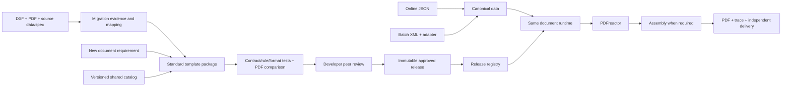
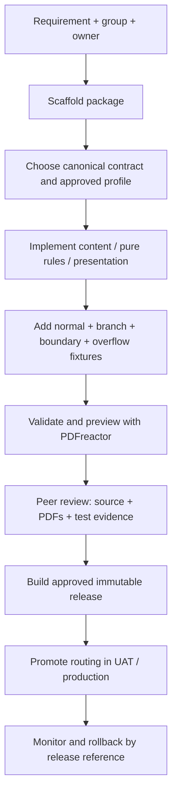

# CCM project structure and developer workflow

Design baseline: 2026-10-03. Scope confirmed by the user: **about 800 templates in total, including about 300 Letters**. Other groups include Sales Illustration (SI), Application Form and Policy Pack; their individual counts are not yet known. The team consists of developers, with no BA role. This design supersedes the BA/workbench-first authoring assumption in earlier proposals, while retaining their online/batch/rendering separation.

## 1. Architecture decision

Use **one developer platform, one versioned template-package contract, and separate document-group capabilities**. Maintain one repository initially. A template is a package of content, data contracts, rules, formatting, layout references and fixtures; it is not an independently deployed application.

Start with Git + CLI + automated tests + PDF preview + peer review. A visual template editor is optional later, and must read/write the same package format rather than introducing a second source of truth. Keep the current Node/Handlebars/PDFreactor implementation for the executable example; JSON contracts and package boundaries remain language independent.



Migration and new authoring converge at the same package. Exstream adapters and provenance are outside the native document runtime. New templates have specification-based expected outputs and never need fabricated DXF references.

## 2. Target repository

```text
ccm-platform/
  apps/
    cli/                       # new, validate, preview, test, impact, build
    document-api/              # online requests and job status
    workers/                   # batch/render/assembly/delivery processes
    preview/                   # PDF review viewer; no BA editor required
  packages/
    contracts/                 # versioned common + domain contracts
    mapping/                   # source adapters and approved enrichment
    rules/                     # tested decision modules and shared rule utilities
    formatting/                # money, percent, dates, identifiers
    composition/               # binding, Handlebars, component resolution
    rendering/                 # PDFreactor adapter and environment profile
    assembly/                  # ordered parts, attachments, fillers, numbering
    validation/                # data/rule/content/layout/regression checks
    registry/                  # release resolution, locks, dependency graph
  catalog/
    groups/                    # allowed capabilities by document family
    profiles/                  # approved page/layout/barcode profiles
    components/                # header, address, tables, declarations, etc.
    assets/                    # versioned fonts/images/content/attachment refs
  templates/
    letter/<template-id>/<version>/
    si/<template-id>/<version>/
    application-form/<template-id>/<version>/
    policy-pack/<template-id>/<version>/
  migration/
    inventory/                 # all 800 template families and variants
    <template-id>/             # source mapping, evidence, gaps, acceptance
  tests/
    shared/                    # component/formatter/renderer qualification
    integration/               # online/batch/assembly and cross-package tests
  deployment/                  # API/worker infrastructure; not per template
```

These directories describe the target monorepo, not a claim that APIs/workers already exist. In this PoC, the executable platform slice is under `platform/`; existing audited templates, components, fonts and fixtures stay at their current paths and are referenced by the package manifest. This avoids maintaining duplicate versions of IPPLT while the architecture is introduced.

### Standard package contents

```text
<group>/<template-id>/<version>/
  manifest.json                # identity, group, owner, exact dependencies
  template.hbs                 # semantic HTML and shared partials
  contract.json                # domain contract reference/extension
  rules.js / rules.ts          # pure decisions; tests required
  presentation.js              # canonical input -> view model
  content/                     # versioned literal wording/locales
  overrides.css                # only documented profile differences
  fixtures/                    # normal, branch, boundary, overflow cases
  tests/                       # expected decisions/text/pages/geometry
  evidence.json                # migration or new-authoring acceptance
  assembly.json                # only for a composed document pack
```

The example manifest references the equivalent files already present in the PoC. Developers may keep simple wording inside Handlebars initially; extract shared or independently versioned wording when reuse warrants it. Do not invent a component or a new rule language for every paragraph.

## 3. Separate concerns explicitly

| Layer | Owns | Must not own |
|---|---|---|
| Source adapter | XML/JSON mapping, legacy field/code translation, source-specific normalization | HTML/CSS or template conditions |
| Canonical contract | Business field names, types, cardinality, null/empty behavior, schema version | Exstream variable names or formatted money masquerading as numbers |
| Calculation/enrichment | Approved financial calculations, reference lookups, effective-date inputs | Unverified formulas inferred from a PDF |
| Decisions | Eligibility, section/row visibility, document/attachment selection | Coordinates, fonts, inline HTML |
| Formatters | Approved amount precision, date/calendar display, identifier formatting | Refund totals, premium calculations, source lookup queries |
| Presentation model | Prepared strings, flags, rows for rendering | Hidden network calls or data updates |
| Template/components | Content order, `if`/`each`, semantic tables | Business arithmetic or executable document JavaScript |
| Layout profile | Shared geometry, first/continuation pages, barcode/signature regions | Customer values |
| Assembly | Generated/external part order, inclusion, duplex/filler/numbering | Pretending an attachment is merely HTML overflow |
| Delivery | Send an already completed immutable PDF and track acknowledgement | Re-rendering on every delivery retry |

For developer authors, typed modules are the initial rule implementation. Common rules can later use a constrained JSON decision format when there is enough repetition to justify an interpreter. Complex calculations stay behind registered, reviewed modules/services. **Do not evaluate JavaScript expressions supplied as template configuration or request data.**

Canonical schemas should use a shared vocabulary plus group/domain extensions, rather than one huge object with hundreds of optional fields. IDs/phone numbers remain strings; money uses exact decimal strings with explicit currency/scale contracts; source dates require explicit calendar and format. Existing IPPLT v1 deliberately accepts `document.dateText` and resolved refund wording because the upstream definitions are incomplete. Introducing ISO dates or structured payment details is a separately versioned contract change, not an implicit rename.

## 4. Group capabilities

| Group | Reusable building blocks | Specialized validation | Example implementation now |
|---|---|---|---|
| Letter (~300) | Letterhead, address/barcode, body, detail/refund tables, closing | Window position, long address/name, branch content, continuation/footer | IPPLT executable package |
| SI | Product summary, benefits/premium projection tables, assumptions/disclosures | Product/rate version, verified calculation inputs/outputs, repeated table headers, totals and pagination | Group definition and draft scaffold only |
| Application Form | Field grid, checkboxes, declarations, signature/witness regions | Required/conditional fields, explicit yes/no/absent behavior, signature-space and overflow rules | Group definition and draft scaffold only |
| Policy Pack | Cover, schedule, clauses, endorsements, external provisions | Exact part order/version, missing attachments, duplex alignment, total/part numbering | Assembly-oriented group and draft scaffold only |

**Shared CSS means shared implementation with governed profiles.** It does not mean imposing one page geometry on all 800 templates. Change brand tokens globally only through a new shared release and impact tests. A baseline-required difference becomes a named profile/variant or documented narrow override, not a copied stylesheet.

The recently standardized 62.2×25pt barcode is the approved direction for the three current PoC letters. It is not automatically the correct production standard for all 800 outputs. Any intentional deviation from an Exstream reference belongs in acceptance evidence; do not hide differences with new comparison masks or claim exact parity from a high Grid score.

## 5. Manifest and dependencies

The runnable example is [manifest.json](platform/templates/letter/ipplt/1.0.0/manifest.json):

```json
{
  "schemaVersion": "ccm.template/1.0",
  "id": "letter.ipplt",
  "version": "1.0.0",
  "group": "letter",
  "mode": "compose",
  "status": "draft",
  "dependencies": {
    "contract": "ipplt-input@1.0.0",
    "rules": "ipplt-rules@1.0.0",
    "preparer": "ipplt-presentation@1.0.0",
    "layout": "letter-flow@1.0.0",
    "components": "letter-common@1.0.0",
    "brand": "fwd-thai@1.0.0",
    "formatters": ["decimal-group2@1.0.0"],
    "renderer": "handlebars-pdfreactor@1.0.0"
  }
}
```

This excerpt omits fixture/entry/evidence fields; use the full file when executing it. Dependencies use exact versions; `latest` and ranges are rejected. A package cannot select a layout that its group has not enabled, or select a rule/formatter that its preparer is not wired to use.

Build a lock containing **content hashes of templates, rules, contracts, CSS, components, fonts, assets and package-lock**. The PoC copies those declared files into a digest-addressed preview snapshot and verifies the bytes before rendering that snapshot. Working-copy previews remain developer previews. A preview digest is neither a signature nor a production release approval.

For production, promote the exact approved artifact and renderer container digest across environments. Do not rebuild it separately in UAT and production. Pin reference-data/attachment versions and calculation-service outputs in the job as well; otherwise source-code pinning alone cannot reproduce output. Retire and garbage-collect releases only after retention and active-job requirements permit it.

## 6. Developer creation flow after migration



Roles are developer author, developer reviewer and release/operations owner; one person may hold multiple roles in a small team, with the organization's required separation for production approval. A BA editor is not a prerequisite. Business wording/calculation ownership must still be identified where the development team cannot authorize changes itself.

1. Declare purpose, group, owner, locale/product/channel/effective-date scope and acceptance criteria.
2. Reuse a contract/profile/component first. Register a new version when behavior changes; do not silently edit the implementation of an already published version.
3. Implement pure decisions and explicit mappings. Use shared formatters. The request supplies business data, not a template path, CSS, HTML or executable expression.
4. Add tests and expected outputs before requesting peer approval. For a new document, expected output comes from the approved specification; no Exstream baseline is required.
5. Review content and data behavior together with PDF appearance. A renderer-success response alone is not acceptance.
6. Publish/promote the exact reviewed artifact through CI. Capture reviewer, commit, dependency digest, test results, renderer version and approved deviations.
7. Route production requests to that release. Rollback changes routing to a prior compatible release; do not mutate previous artifact bytes.

A future editor, if added, performs these same operations on the same package contract. It must not bypass validators, profile restrictions, tests or release evidence.

## 7. Migration flow for the 800-template portfolio

1. **Inventory and group:** identify logical templates, active versions, variants, products/channels/languages, source DXF application identity and reference PDFs. Do not count each PDF or data variant as a new template.
2. **Evidence matrix:** account for every used variable, rule, formula, formatter, lookup, repetition driver, attachment and layout region. Record source location, new contract/rule mapping, covered fixture and unresolved dependency.
3. **Classify:** simple content letters, conditional/table letters, calculation-heavy SI, fixed/conditional forms, and assembly-heavy packs. Pilot representative complex members early; do not defer every difficult Policy Pack until the end.
4. **Normalize input:** keep source-specific mappings in migration/integration adapters. Missing formulas remain explicit gaps; never reconstruct financial behavior by guessing from printed values.
5. **Implement standard package:** reuse profiles/components and shared formatting, then add documented exceptions. Migrated packages enter the same authoring/release path as new packages.
6. **Prove equivalence:** render with matched input where available, cover branch/boundary/overflow cases, compare data/rules/text/geometry/pages/assembly, and record accepted intentional differences.
7. **Parallel run and cutover:** route a limited approved cohort, compare actual outputs and operational behavior, expand by family, and keep a compatible rollback route until acceptance is complete.

A migration evidence matrix should contain:

| Item | Source evidence | Target | Acceptance evidence |
|---|---|---|---|
| Variable | DXF variable + input mapping | Canonical field/type | Required/absent/edge fixtures |
| Formula/lookup | Actual body and dependency/version | Calculation/enrichment module | Numeric expected results and reference-data version |
| Rule | Condition and all use sites | Named decision | Both outcomes and interactions |
| Format | Mask, scale, locale/calendar, per-use override | Formatter/profile version | Zero/negative/large/absent/date-boundary cases |
| Repetition | Driver and row alignment | Object collection | Zero/one/many/long/misaligned-source cases |
| Layout | Measured PDF region | Shared profile/variant | Anchors, wrapping, no overlap/cropping |
| Assembly | Inclusion/order/duplex/numbering | Assembly definition | Selected parts, page maps, missing-part failure |

Track migration status separately from release status. Suggested migration stages: `discovered → source-audited → mapped → implemented → behavior-verified → visual-accepted → operational-accepted → cutover`. An open source dependency may block production acceptance while development previews continue.

## 8. Validation and CI

| Gate | Required checks |
|---|---|
| Package/config | Valid IDs/versions, group profile allowlist, dependency closure, no unknown keys |
| Data and binding | Contract types, required paths, empty/null policy, strict template bindings, escaping |
| Decisions/calculations | Branch coverage, exact amounts, date boundaries, source rule interactions, lookup versions |
| Content | Required text/IDs/amounts present, rows complete and ordered, no undefined/null artifacts |
| PDF layout | Expected document page count, positions, line wraps, fonts, tables, footer/closing clearance |
| Visual reference | PDFreactor raster comparison plus review; matched data or explicitly reference-only |
| Print/assembly | Barcode scan tests where required, attachments/order, duplex fillers, final/part page numbering |
| Shared-change impact | Reverse dependency graph selects every consuming package and all required fixtures |
| Runtime/operational | Representative load, retry/idempotency, missing resources, recovery and delivery acknowledgement |

Keep assertions separate from test execution. The current IPPLT evidence honestly records missing matched-data/source acceptance. Evaluation pages/watermarks must be classified explicitly in PoC checks; qualify production using the licensed renderer environment.

Proposed CI sequence: lint/schema checks → package tests → shared impact matrix → parallel fixture renders → text/page/geometry checks → image comparisons → publish review artifacts → peer approval → immutable release build/promotion. Test all supported engine/profile combinations when upgrading fonts, renderer or barcode generation. Cache by input + package digest + engine/reference-data versions, not template name alone.

Production JSON schemas can drive validation and developer completion; use versioned shared schema references. The current PoC uses explicit JavaScript validators and is **not a general JSON Schema validator**. [JSON Schema's official guide](https://json-schema.org/learn/getting-started-step-by-step) describes the standard schema vocabulary and references.

## 9. Policy Pack assembly contract

Keep a pack separate from a single rendered template. Its definition references exact releases or immutable attachment IDs, never arbitrary request URLs or local paths. A proposed part has:

```json
{
  "id": "rider-provisions",
  "kind": "externalPdf",
  "selectionRule": "includeSelectedRiderProvisions",
  "attachmentSet": "approved-rider-provisions@1.0.0",
  "required": true,
  "startOn": "odd",
  "numbering": "preserve-part"
}
```

This is a target contract example, not an implemented pack. Resolve selections and versions before rendering; generate selected child documents; inspect actual page counts; insert documented duplex fillers; merge in manifest order; apply the required total/part numbering policy; validate the final PDF and page map. Fail the job when a required selected attachment is missing. Do not call an overflow page, an additional receipt and an external provision the same thing.

PDFreactor exposes rendering and PDF-combination capabilities through its APIs, but the platform still owns selection, versioning, missing-part handling and acceptance. Verify the exact merge/numbering behavior against representative packs before implementation acceptance. [Official PDFreactor API](https://www.pdfreactor.com/product/webservice/doc/javascript.html).

## 10. Production service and configuration boundaries

Keep one modular backend initially, with separate API, render/batch and delivery processes where capacity/isolation requires it. Existing AWS/EKS proposals remain deployment options; template count alone is not enough to decide cluster size or microservice count.

| Object | Key information |
|---|---|
| Template release | Template ID, exact version/digest, group, dependency lock, acceptance evidence |
| Routing release | Document type/product/channel/locale/effective date → approved release; ambiguous matches fail |
| Job | Request/idempotency identity, canonical payload hash, pinned release, processing date, calculation/reference-data versions |
| Render trace | Decisions, renderer image/version, asset hashes, output hash, timing/error classification |
| Assembly manifest | Selected child releases/attachments, ordered pages, fillers and numbering scopes |
| Delivery record | Completed PDF identity, destination, attempts and acknowledgement; independent of rendering |

Suggested API contracts: `POST /v1/document-jobs`, `GET /v1/document-jobs/{id}`, internal preview/build endpoints, and an authenticated release-promotion operation. Online and batch use the same canonical package/runtime. Untrusted clients select an authorized document type/context; they cannot choose arbitrary modules or filesystem paths.

Use durable metadata for jobs/releases/routing and object storage for payloads, artifacts/PDFs/evidence. Avoid customer payloads in application logs; use synthetic fixtures in source control. Fetch lookups and attachments through controlled adapters. Keep document JavaScript disabled when rendering prepared HTML. Handlebars normally escapes `{{value}}`; raw output is reserved for controlled helpers such as the generated barcode. [Handlebars security guidance](https://handlebarsjs.com/guide/security.html), [PDFreactor JavaScript settings](https://www.pdfreactor.com/product/doc/apidocs/com/realobjects/pdfreactor/Configuration.JavaScriptSettings.html).

Retry bounded transient render failures using the same pinned inputs/release; do not retry data/contract failures indefinitely. Publish job/output state atomically or reconcile partial storage/queue operations. Reuse completed PDFs for delivery retries. Benchmark representative page/asset/assembly sizes and concurrency before choosing SLA/capacity; the historical 6-second/50,000-document targets in older proposals are not newly confirmed by this request.

## 11. Implementation stages

1. **Foundation/pilot:** adopt contracts and package format; prove representative members of all four groups; quantify source gaps and actual acceptance effort.
2. **Letter migration lane:** create a small set of proven letter profiles, run cohort migrations with shared-change impact testing, and cut over approved packages incrementally.
3. **Other group capabilities:** implement SI calculations/table profiles, form components, and pack assembly in parallel with migration where staffing permits. Require representative source/spec evidence for each.
4. **Production control plane:** immutable registry/promotion, routing, APIs/workers, permissions, audits, operational retry/delivery, licensed-engine/load qualification.
5. **Steady-state authoring:** new templates use the same CLI/config/tests/release flow; retire source adapters when no longer used, preserving audit evidence according to retention policy.

Do not derive schedule from 800 divided by developers alone. Measure accepted templates per complexity group during pilots, including review/rework and external dependency resolution. Track throughput, defect escape, shared-component coverage, missing-rule/formula rate and production acceptance separately.

## 12. What is implemented in this project

- Four group definitions and one registered runnable Letter package (IPPLT).
- CLI: list/inspect/validate/render, impact analysis, preview build/hash verification, new-package scaffolds and readiness reporting.
- IPPLT contract → separate rules → shared formatter → presentation → existing Handlebars/CSS → PDFreactor. No copied layout or Exstream fields in the native pipeline.
- Strict rendering in the platform path; exact-version and local-resource/dependency checks; per-run outputs/traces.
- Digest-addressed preview snapshots of declared source/assets. They can be verified and rendered using the snapshot CLI with installed locked dependencies.
- New-template scaffolds for all four groups. SI/form profiles and Policy Pack assembly intentionally remain incomplete and cannot render as if implemented.

Not implemented: production APIs/queue, authenticated publish/approvals, production registry/routing, assembly engine, SI calculation service, form library, full schema platform, or visual authoring UI. No existing template is claimed production accepted. See [platform/README.md](platform/README.md) for runnable commands and [the IPPLT package](platform/templates/letter/ipplt/1.0.0/manifest.json).

Prior context: [platform infrastructure proposal](../Design/pdfreactor-platform-architecture.md), [letter configuration proposal](../Design/letter-group-configuration-design.md). Their older field names/workbench assumptions are design history; current runnable contracts and the developer-only workflow above take precedence for this example.
